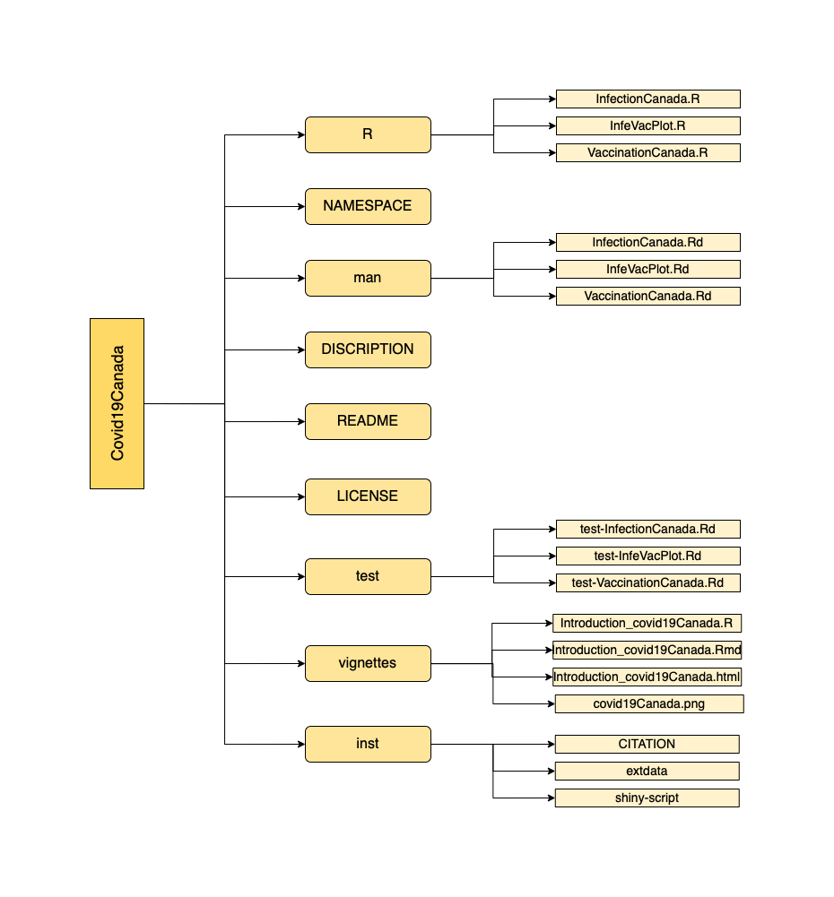

<!-- README.md is generated from README.Rmd. Please edit that file -->

# covid19Canada

<!-- badges: start -->
<!-- badges: end -->

## Description

`covid19Canada` is an R package to demonstrate and further analyzes
Canadian COVID-19 infection and vaccination information extracted from
covid19.analytics package. This includes the main components:
DESCRIPTION, NAMESPACE, man subdirectory and R subdirectory.
Additionally, licence, README and subdirectories vignettes, tests, data
and inst are also explored. The package was developed using R version
4.1.1 and Mac platform.

## Installation

To install the latest version of the package:

``` r
require("devtools")
devtools::install_github("RicoZong/covid19Canada", build_vignettes = TRUE)
library("covid19Canada")
```

## Overview

``` r
ls("package:covid19Canada")
data(package = "covid19Canada") # optional
```

`covid19Canada` contains 3 functions to demonstrate and further analyzes
Canadian COVID-19 infection and vaccination information extracted from
covid19.analytics package. The *InfectionCanada* is function that
demonstrates the COVID-19 infection data in Canada.User can enter the
date of interest and interested province as the arguments to better
analyze Canadian COVID-19 infections.The *InfeVacPlot* function that
generates the plotting demonstrating the correlation of COVID-19
vaccination and infection in Canada. *VaccinationCanada* A function that
demonstrates the COVID-19 vaccination data in Canada. User is able to
enter the date of interested to look up the vaccination data of Canada
on that specific date. Refer to package vignettes for more details.

``` r
browseVignettes("covid19Canada")
```

An overview of the package is illustrated below.



## Contributions

The author of the package is Ruicong Zong. The *InfectionCanada*
function makes use of covid19.Canada.data function from
`covid19.analytics` R package to generate the datafram the contains the
COVD-19 infection data. *InfeVacPlot* function makes use of
covid19.Canada.data and covid19.vaccination functions from
`covid19.analytics` R package to get both vaccination and infection
data. It also uses plot function from `tidyverse` and `reshape` R
package to generate plotting. The *Vaccinationanada* makes use of
covid19.vaccination from the `covid19.analytics` R package to get
vaccination data. (Section of the borrowed code is clearly indicated and
referenced in the InfectionCanada, InfeVacPlot and VaccinationCanada
help file)

## References

H. Wickham. Reshaping data with the reshape package. Journal of
Statistical Software, 21(12), 2007.

H. Wickham. ggplot2: Elegant Graphics for Data Analysis. Springer-Verlag
New York, 2016.

Ponce et al. (2021). covid19.analytics: An R Package to Obtain, Analyze
and Visualize Data from the Coronavirus Disease Pandemic. Journal of
Open Source Software, 6(59), 2995. <https://doi.org/10.21105/joss.02995>

R Core Team (2021). R: A language and environment for statistical
computing. R Foundation for Statistical Computing, Vienna, Austria. URL
<https://www.R-project.org/>.

Wickham et al., (2019). Welcome to the tidyverse. Journal of Open Source
Software, 4(43), 1686, <https://doi.org/10.21105/joss.01686>

## Acknowledgements

This package was developed as part of an assessment for 2021 BCB410H:
Applied Bioinformatics, University of Toronto, Toronto, CANADA.
