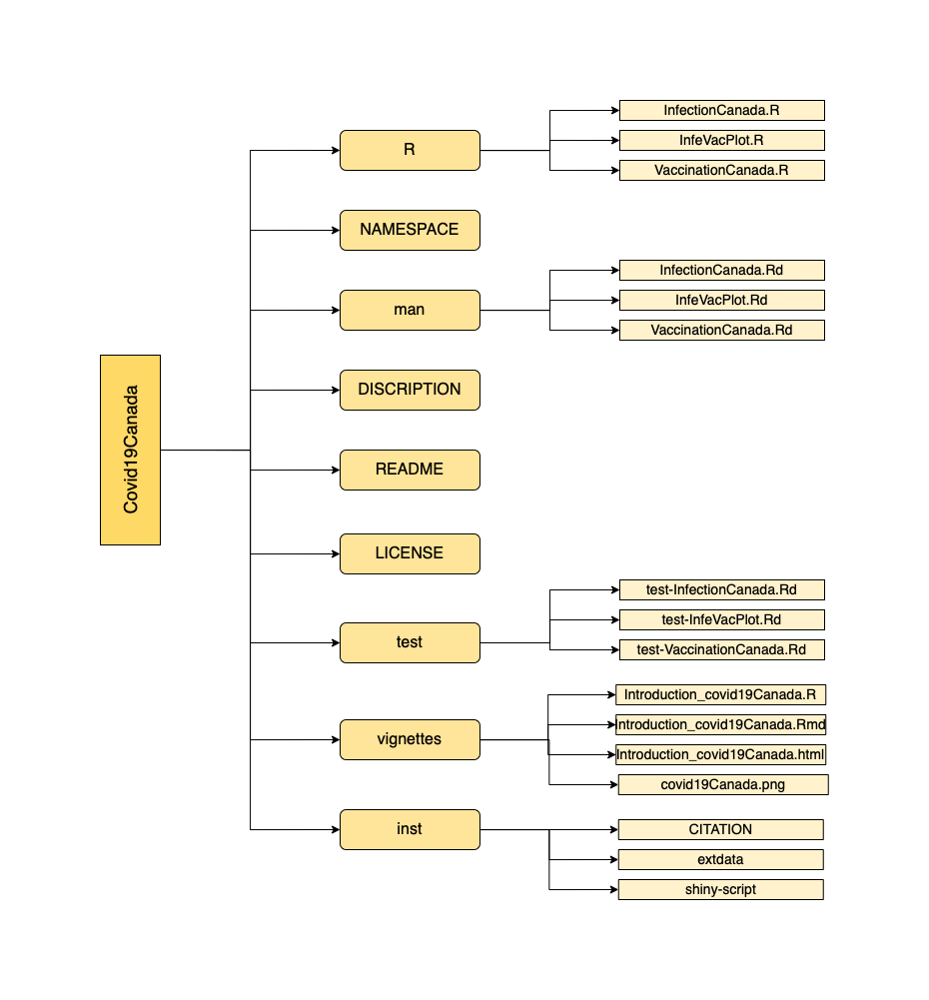

```{r setup, include=FALSE}
library(knitr)
opts_chunk$set(fig.align = "center", 
               out.width = "90%",
               fig.width = 6, fig.height = 5.5,
               dev.args=list(pointsize=10),
               par = TRUE, # needed for setting hook 
               collapse = TRUE, # collapse input & ouput code in chunks
               warning = FALSE)
knit_hooks$set(par = function(before, options, envir)
  { if(before && options$fig.show != "none") 
       par(family = "sans", mar=c(4.1,4.1,1.1,1.1), mgp=c(3,1,0), tcl=-0.5)
})
set.seed(1) # for exact reproducibility
```
       
## Introduction

`covid19Canada` is an R package to demonstrate and further analyzes Canadian COVID-19 infection and vaccination information extracted from covid19.analytics package. This includes the main components: DESCRIPTION, NAMESPACE, man subdirectory and R subdirectory. Additionally, licence, README and subdirectories vignettes, tests, data and inst are also explored. The package was developed using R version 4.1.1 and Mac platform. **This document gives a tour of covid19Canada (version 0.1.0)**. It was written in R Markdown.


To download **covid19Canada**, use the following commands:

``` r
require("devtools")
install_github("RicoZong/covid19Canada", build_vignettes = TRUE)
library("covid19Canada")
```
To list all sample functions available in the package:
``` r
ls("package:covid19Canada")
```

To list all sample datasets available in the package:
``` r
data(package = "covid19Canada")
```

<br>

## Components

<div style="text-align:center">


## Functions

* The **InfectionCanada** A function that demonstrates the COVID-19 infection data in Canada.User can enter the date of interest and interested province as the arguments to better analyze Canadian COVID-19 infections.
Example:
``` r
CanadaInfection <- InfectionCanada("01-01-2021", "Ontario")
CanadaInfection
#Returns a data frame with 40 different columns that each #indicates COVID-19 related counts.
```
* The **VaccinationCanada** A function that demonstrates the COVID-19 vaccination data in Canada. User is able to enter the date of interested to look up the vaccination data of Canada on that specific date.  Refer to package vignettes for more details.
Example:
```r
covidVaccination <- VaccinationCanada("2021-01-01")
covidVaccination
#Returns a data frame with 16 different columns that each #indicates COVID-19 vaccination related counts.
```

* The **InfeVacPlot** A function that generates the plotting demonstrating the correlation of COVID-19 vaccination and infection in Canada.
Example:
```r
InfeVacPlot(TRUE, TRUE, TRUE)
#Returns a line plot that demonstrates the correlation of
#COVID-19 vaccination(vaccinated & fully vaccinated) and
#infection(infection & death) in Canada.
```
<div style="text-align:center">
<br>

## Package References

Ruicong, Z. (2021) covid19Canada: Canada Covid-19 Infection and
  Vaccination Data and Analysis. Unpublished. URL
  https://github.com/RicoZong/covid19Canada

<br>

## Other References

H. Wickham. Reshaping data with the reshape package. Journal of Statistical Software, 21(12), 2007.

H. Wickham. ggplot2: Elegant Graphics for Data Analysis. Springer-Verlag New York, 2016.

Ponce et al. (2021). covid19.analytics: An R Package to Obtain, Analyze and Visualize Data from the Coronavirus Disease Pandemic. Journal of Open Source Software, 6(59), 2995. https://doi.org/10.21105/joss.02995

R Core Team (2021). R: A language and environment for statistical computing. R Foundation for Statistical Computing, Vienna, Austria. URL https://www.R-project.org/.

Wickham et al., (2019). Welcome to the tidyverse. Journal of Open Source Software, 4(43), 1686, https://doi.org/10.21105/joss.01686

----

```{r}
sessionInfo()
```
